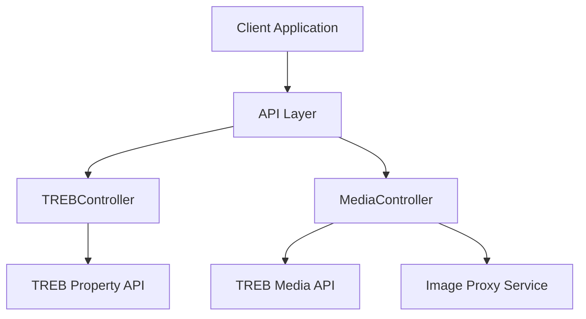
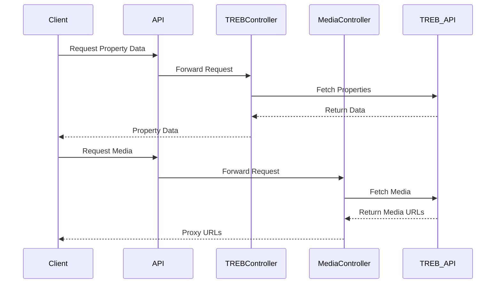

# TREB (Toronto Real Estate Board) Integration Guide

## Table of Contents
1. [Overview](#overview)
2. [Architecture](#architecture)
3. [Components](#components)
4. [Authentication](#authentication)
5. [API Endpoints](#api-endpoints)
6. [Data Flow](#data-flow)
7. [Media Handling](#media-handling)
8. [Error Handling](#error-handling)
9. [Performance Considerations](#performance-considerations)
10. [Security Considerations](#security-considerations)

## Overview

The TREB integration system provides a seamless connection to the Toronto Real Estate Board's data services. It handles:
- Property listings
- Property media (images)
- Data transformation
- Secure media proxying

### Key Features
- Real-time property data fetching
- Secure image proxying
- Caching mechanisms
- Error handling and logging
- RESO standard compliance

## Architecture

### System Components


### Data Flow


## Components

### 1. TREBController
Located at: `app/Http/Controllers/API/TREBController.php`

```php
class TREBController extends Controller
{
    public function fetch()
    {
        // Fetches property listings
        // Returns: Property data with MLS numbers
    }
}
```

Key Responsibilities:
- Fetches property listings from TREB
- Handles property data transformation
- Manages property-related errors
- Implements caching for property data

### 2. MediaController
Located at: `app/Http/Controllers/API/MediaController.php`

```php
class MediaController extends Controller
{
    public function getPropertyMedia(Request $request)
    {
        // Fetches media for specific property
        // Returns: Media data with proxy URLs
    }

    public function proxyImage(Request $request)
    {
        // Proxies image requests
        // Returns: Actual image data
    }
}
```

Key Responsibilities:
- Fetches property media
- Handles image proxying
- Manages media caching
- Implements security measures

## Authentication

### TREB API Authentication
```php
protected $token = 'eyJhbGciOiJIUzI1NiJ9...';

protected function makeRequest($url)
{
    return Http::withHeaders([
        'Authorization' => 'Bearer ' . $this->token,
        'Accept' => 'application/json',
        'Content-Type' => 'application/json',
        'OData-Version' => '4.0'
    ]);
}
```

## API Endpoints

### Property Endpoints

1. **Fetch Property Listings**
```
GET /api/trebdata
Response:
{
    "success": true,
    "data": [
        {
            "mlsNumber": "C5841925",
            "address": "123 Main St",
            // ... other property data
        }
    ]
}
```

2. **Get Property Details**
```
GET /api/properties/{id}
Response:
{
    "id": "123",
    "mlsNumber": "C5841925",
    // ... detailed property data
}
```

### Media Endpoints

1. **Get Property Media**
```
GET /api/media/property?mlsNumber=C5841925
Response:
{
    "value": [
        {
            "MediaKey": "abc123",
            "MediaURL": "https://...",
            "ProxyURL": "/api/media/proxy?url=..."
        }
    ]
}
```

2. **Proxy Image**
```
GET /api/media/proxy?url=encoded_url
Response: Binary Image Data
Headers:
- Content-Type: image/jpeg
- Cache-Control: public, max-age=31536000
```

## Data Flow

### Property Data Flow
1. Client requests property data
2. TREBController makes authenticated request to TREB
3. TREB returns property data
4. Data is transformed and returned to client

### Media Flow
1. Client requests property media using MLS number
2. MediaController queries TREB media API
3. TREB returns media metadata
4. MediaController generates proxy URLs
5. Client receives media data with proxy URLs
6. Client requests images through proxy
7. MediaController fetches and serves images

## Media Handling

### Image Proxying Process
```php
public function proxyImage(Request $request)
{
    // 1. Get image URL from request
    $imageUrl = $request->query('url');

    // 2. Extract MediaKey
    $pattern = '/Media\/([^\/\s]+)/';
    preg_match($pattern, $imageUrl, $matches);
    $mediaKey = $matches[1];

    // 3. Fetch metadata
    $metadataUrl = $this->baseUrl . "('" . $mediaKey . "')";
    $metadata = $this->fetchMetadata($metadataUrl);

    // 4. Get actual image
    $actualMediaUrl = $metadata['MediaURL'];
    $response = $this->fetchImage($actualMediaUrl);

    // 5. Return image with caching
    return response($response->body(), 200, [
        'Content-Type' => $response->header('Content-Type', 'image/jpeg'),
        'Cache-Control' => 'public, max-age=31536000'
    ]);
}
```

### Image Size Handling
- Default size: 'Large'
- Available sizes: Small, Medium, Large
- Size selection via query parameter: `?size=Large`

## Error Handling

### Common Error Scenarios
1. TREB API Unavailable
2. Invalid MLS Number
3. Media Not Found
4. Authentication Failure

### Error Response Format
```json
{
    "success": false,
    "error": "Error description",
    "status": 400,
    "message": "Detailed error message"
}
```

## Performance Considerations

### Caching
1. Property Data:
   - Cache Duration: 1 hour
   - Cache Key: `treb_property_{mls_number}`

2. Media Data:
   - Cache Duration: 24 hours
   - Cache Key: `treb_media_{media_key}`

3. Images:
   - Cache-Control: 1 year
   - Browser caching enabled

### Rate Limiting
```php
// In MediaController
protected $maxRequestsPerMinute = 60;
protected $maxConcurrentRequests = 10;
```

## Security Considerations

### 1. API Authentication
- Bearer token authentication
- Token rotation schedule
- Access control via middleware

### 2. Media Security
- All media requests proxied
- No direct TREB URLs exposed
- URL signing for media requests

### 3. SSL/TLS
- Secure connections required
- SSL verification in production
- Certificate validation

### 4. Data Validation
- Input sanitization
- Parameter validation
- SQL injection prevention

## Implementation Examples

### 1. Fetching Property with Media
```javascript
async function loadPropertyWithMedia(mlsNumber) {
    // 1. Get property data
    const propertyResponse = await fetch('/api/trebdata');
    const propertyData = await propertyResponse.json();

    // 2. Get media data
    const mediaResponse = await fetch(`/api/media/property?mlsNumber=${mlsNumber}`);
    const mediaData = await mediaResponse.json();

    // 3. Combine data
    return {
        ...propertyData,
        media: mediaData.value
    };
}
```

### 2. Displaying Images
```javascript
function displayPropertyImages(mediaData) {
    mediaData.forEach(media => {
        const img = document.createElement('img');
        img.src = media.ProxyURL;
        img.alt = media.MediaDescription || 'Property Image';
        document.querySelector('.gallery').appendChild(img);
    });
}
```

## Troubleshooting

### Common Issues

1. **Image Loading Failures**
   - Check proxy URL format
   - Verify MediaKey extraction
   - Confirm TREB API status

2. **Property Data Issues**
   - Validate MLS number
   - Check API response format
   - Verify data transformation

3. **Performance Issues**
   - Monitor cache hit rates
   - Check concurrent requests
   - Verify rate limiting

### Logging
```php
Log::info('TREB API Response', [
    'status' => $response->status(),
    'body' => $response->body()
]);
```

## Maintenance

### Regular Tasks
1. Token rotation
2. Cache cleanup
3. Error log review
4. Performance monitoring

### Monitoring
- API response times
- Error rates
- Cache hit rates
- Media proxy performance 
